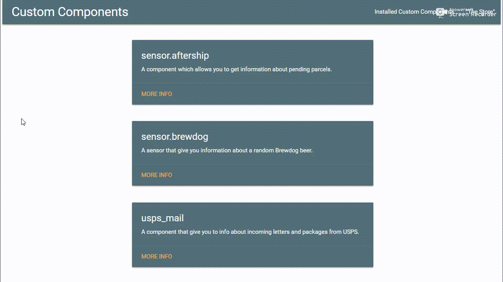

# custom-component-store



## Installation

```bash
sudo docker run -d --name custom-component-store -p 9999:9999 -v /path/to/HA/config:/config ludeeus/custom-component-store:dev
```

Now Open browser to `http://DOCKERHOST:9999`

## Upgrade

```bash
sudo docker rm -f custom-component-store
sudo docker run -d --name custom-component-store -p 9999:9999 -v /path/to/HA/config:/config ludeeus/custom-component-store:dev
```

Now Open browser to `http://DOCKERHOST:9999`
